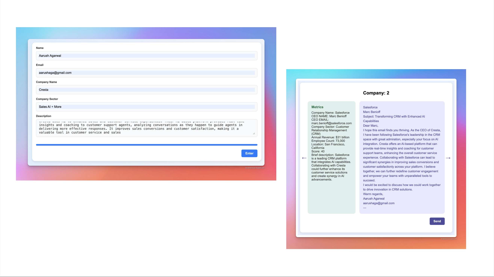

<h1 align="center"> ✨ PropsectIQ ✨ </h1>

### Introduction
Built during the Carnegie Mellon NovaHacks Hackathon, PropsectIQ is an early-stage prototpye for a platform that aids startups in finding and reaching out to investors.

### Features
- **Investor Search**: Search for investors based on their portfolio, location, and any other factors you deem useful. Powered by the OpenAI API, ProspectIQ uses a custom rubric to tailor investor recommendations to the user's startup.
- **Investor Profiles**: View detailed profiles of investors, including their portfolio, location, and contact information.
- **Email Templates**: ProspectIQ provides a variety of email templates for users to use when reaching out to investors. These templates are customizable and can be tailored to the user's needs.
- **Automated Email Sending**: ProspectIQ can automatically send emails to investors on behalf of the user. This feature is powered by the Gmail API.

### Technologies
- **Frontend**: React.js
- **Backend**: Flask
- **Database**: Json
- **APIs**: OpenAI, Gmail

### Demo

